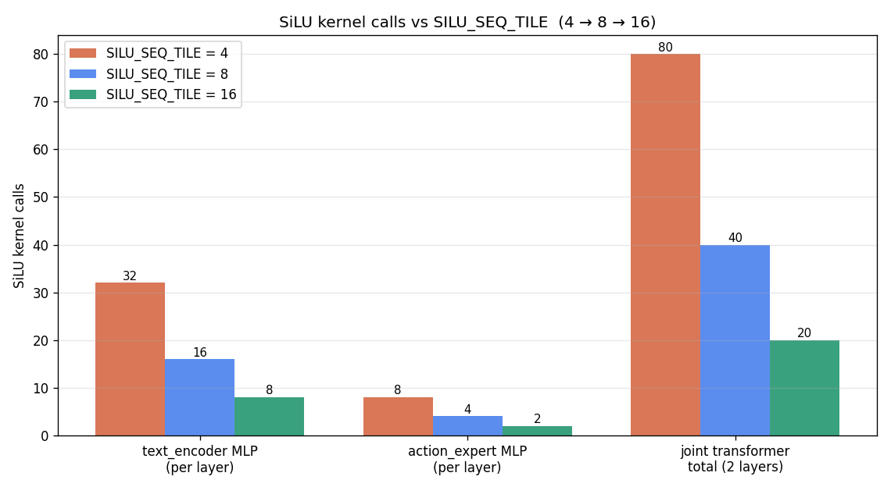

# SiLU kernel size — call-count comparison

## Change history
| Step | SILU_SEQ_TILE | Per-core tile (text / expert) | Build result |
|------|---------------|-------------------------------|--------------|
| Baseline | 4  | [4][160] / [4][256]   | OK |
| 2x | 8  | [8][160] / [8][256]   | OK |
| 4x | **16** | **[16][160] / [16][256]** | **OK** |

Files updated:
- `cc/bf16/silu_160_bf16.cc` (text_encoder, FFN_HID=2560 → 16 cores × 160)
- `cc/bf16/silu_256_bf16.cc` (action_expert, FFN_HID=2048 → 8 cores × 256)
- `vla/text_encoder_bf16.py:265`  → `SILU_SEQ_TILE = 16`
- `vla/action_expert_bf16.py:356` → `SILU_SEQ_TILE = 16`

## Memory check at tile=16 — PASSED
Per-core data buffers (bf16 = 2 B each, ping-pong = 2x):

| Variant         | Buffer (in+out) | + ping-pong | Tile budget | Result |
|-----------------|-----------------|-------------|-------------|--------|
| [16][160]  text | 16·160·2·2 = 10.0 KB |  20.0 KB | 64 KB | **OK** |
| [16][256]  expert | 16·256·2·2 = 16.0 KB |  32.0 KB | 64 KB | **OK** |

Still well below the 64 KB AIE2 tile budget.

## Kernel-call counts

`calls = SEQ // SILU_SEQ_TILE`. text_encoder SEQ=128, action_expert SEQ=32, joint transformer = 2 layers × (text MLP + expert MLP).

| Site                                | tile=4 | tile=8 | tile=16 | Reduction (4→16) |
|-------------------------------------|--------|--------|---------|------------------|
| text_encoder MLP (per layer)        |  32    |  16    |   8     | 4x               |
| action_expert MLP (per layer)       |   8    |   4    |   2     | 4x               |
| Joint transformer total (2 layers)  | **80** | **40** | **20**  | **4x**           |

## Notes
- SEQ=32 (action_expert) becomes the limiting factor: at tile=32 it would saturate (1 call/layer); past that, padding waste begins.
- Each call still uses 16 cores (text_encoder) or 8 cores (action_expert) along the feature dim — call-count reduction comes purely from longer per-core sequence runs, not extra parallelism.
- Wall-clock benefit depends on dispatch overhead vs. per-call compute. With 16 Horner steps the kernel is compute-bound, so expect a modest fraction of the 4x call reduction in actual time saved.
