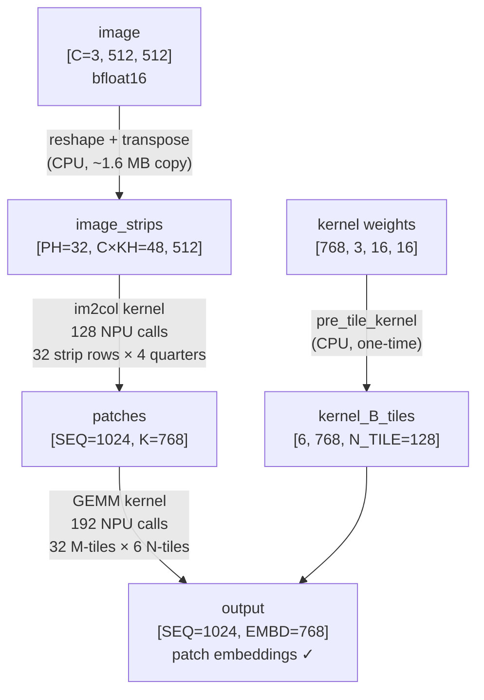
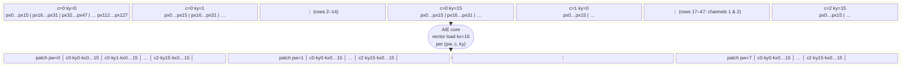
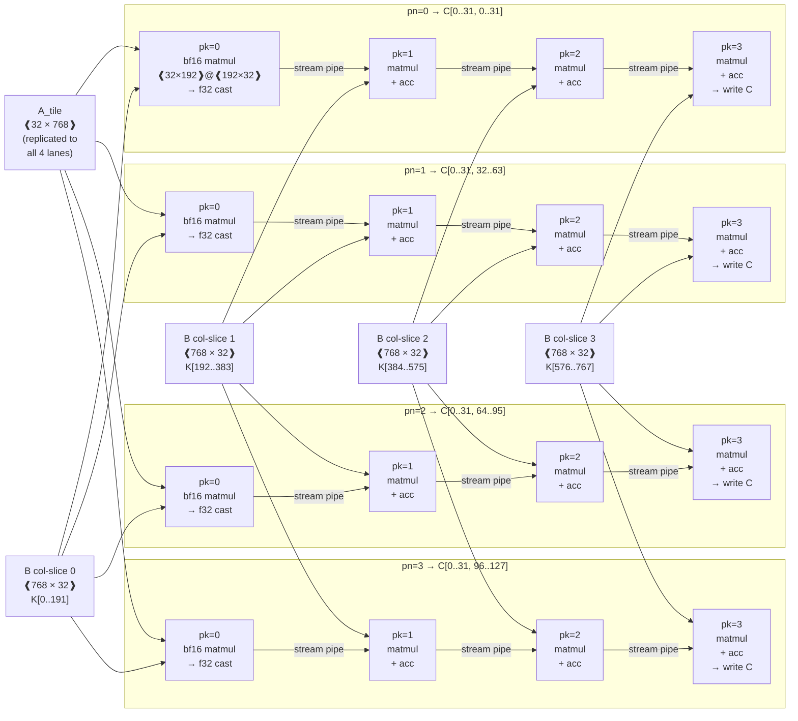
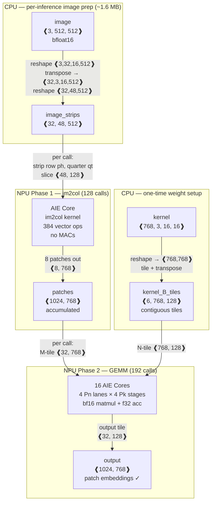

# Fused Preprocessing: Conv2d Patch Embedding on AMD NPU

## Overview

The fused preprocessing pipeline implements Conv2d patch embedding entirely on the AMD XDNA NPU — the operation that converts a raw image into the sequence of patch embeddings fed into a Vision Transformer (ViT).

**Goal:** Transform image `[C=3, 512, 512]` → patch embeddings `[1024, 768]`

This is mathematically equivalent to `torch.nn.Conv2d(3, 768, kernel_size=16, stride=16)` flattened to a sequence, but decomposed into two NPU kernels:



---

## Mathematical Background

A 512×512 image with patch size 16×16 produces a **32×32 = 1024 patch grid**. Each patch has `C × KH × KW = 3 × 16 × 16 = 768` elements. The conv2d with stride=kernel_size is equivalent to:

```
output[seq, embd] = Σ_{c,ky,kx}  image[c, ph*16+ky, pw*16+kx]  ×  kernel[embd, c, ky, kx]
```

where `seq = ph * PW + pw` indexes the flattened patch grid.

Decomposing this into im2col + GEMM:

```
patches[seq, k]  =  image[c, ph*16+ky, pw*16+kx]       where k = c*KH*KW + ky*KW + kx
output[seq, embd] = patches[seq, :] @ kernel_2d[embd, :]ᵀ
                  = patches[seq, :] @ kernel_B[:, embd]
```

---

## CPU Preprocessing (one copy per inference)

Before the NPU can operate on the image, the CPU rearranges it into **strip format** compatible with the NPU's 2D DMA:

```
[C=3, 512, 512]
  reshape →  [3, PH=32, KH=16, 512]
  transpose → [PH=32, C=3, KH=16, 512]
  reshape →  [32, C*KH=48, 512]
```

Each strip `image_strips[ph]` has shape `[48, 512]` where:
- rows `c*16 .. (c+1)*16` = channel `c`, all kernel rows
- columns = pixel positions across the full image width

This is the only CPU work in the hot path (~1.6 MB copy).

---

## NPU Kernel 1: im2col

### Purpose

Rearranges image pixels from strip layout into **patch-column layout** — each output row is one flattened patch vector of length 768, ready for matrix multiplication.

### Dimensions

| Symbol  | Value | Meaning                              |
|---------|-------|--------------------------------------|
| `IMG2D` | 48    | `C × KH` — flattened channel×row    |
| `PIX_QT`| 128   | Pixel columns per quarter-row call   |
| `PW_QT` | 8     | Patches per quarter-row call         |
| `K_FULL`| 768   | `C × KH × KW` — full patch length   |

### Call Pattern

```
128 total calls = PH (32 strip rows) × 4 (quarter-row divisions)
```

Each call processes one quarter of a strip row to stay within 64 KB SRAM:
```
Input  [48, 128]  = 12,288 bytes  × 2 (double-buffer) = 24,576 B
Output [8,  768]  = 12,288 bytes  × 2 (double-buffer) = 24,576 B
Total: 49,152 B + ~1 KB stack < 65,536 B ✓
```

### Mathematical Operation

For each call with strip row `ph` and quarter `qt`:

```
img  [C*KH=48, PIX_QT=128]   — input quarter-strip
pat  [PW_QT=8, K_FULL=768]   — output patches

pat[pw, c*KH*KW + ky*KW + kx]  =  img[c*KH + ky, pw*KW + kx]

for pw ∈ [0, 8)
    for c  ∈ [0, 3)
        for ky ∈ [0, 16)
            for kx ∈ [0, 16)
```

### im2col Diagram



**Index mapping:** column `pw*KW + kx` of every row `c*KH + ky` in `img` → position `c*KH*KW + ky*KW + kx` of row `pw` in `pat`.

```
img [c·KH + ky,  pw·KW + kx]
          │
          └──────────────────────► pat [pw,  c·256 + ky·16 + kx]
               16-wide vector          ◄── 16-wide vector store
               load (one AIE op)
```

### Vectorization (AIE Core)

The inner `kx` loop (size 16) maps exactly to one **16-element bfloat16 vector load/store**:

```
for pw ∈ [0, 8):
  for c ∈ [0, 3):
    for ky ∈ [0, 16):
      vec_t v = aie::load_v<16>(&img[c*16 + ky][pw*16])   // 16-wide vector load
      aie::store_v(&pat[pw][c*256 + ky*16], v)              // 16-wide vector store
```

Total vector ops per call: `PW_QT × CHANNELS × KH = 8 × 3 × 16 = 384` vector ops.
No scalar fallback, no masking — perfectly aligned for the AIE vector engine.

---

## NPU Kernel 2: GEMM

### Purpose

Multiplies the patch matrix against the pre-transposed conv kernel to produce patch embeddings:

```
patches[32, 768] @ kernel_B[768, 128] → output[32, 128]
```

### Core Configuration

| Parameter | Value | Meaning                              |
|-----------|-------|--------------------------------------|
| `Pm`      | 1     | M-parallel tiles (no M sharding)    |
| `Pn`      | 4     | N-parallel lanes                     |
| `Pk`      | 4     | K-reduction chain depth              |
| `M_TILE`  | 32    | Rows per GEMM call (one patch row)   |
| `N_TILE`  | 128   | Output dims per call (4 × 32)        |
| `K_FULL`  | 768   | Full K dimension                     |

**Total cores:** `Pm × Pn × Pk = 1 × 4 × 4 = 16` (exactly the NPU physical limit)

**Per-core SRAM:**
```
A [32, 192] × 2 (double-buf) = 24,576 B
B [192, 32] × 2 (double-buf) = 24,576 B
C [32,  32] × 4 (pipe depth) =  8,192 B
Total: ~57 KB < 64 KB ✓
```

### Call Pattern

```
Total calls = n_m × n_n = 32 × 6 = 192

n_m = SEQ      / M_TILE  = 1024 / 32  = 32
n_n = EMBD_DIM / N_TILE  = 768  / 128 =  6
```

Each call computes one `[32, 128]` output tile. The Pn=4 parallelism means each call actually runs 4 GEMM cores in parallel, each computing a `[32, 32]` sub-tile.

### Mathematical Operation

For GEMM call at tile `(m, n)`:

```
A_tile  = patches[m*32 : (m+1)*32, :]           shape [32, 768]
B_tile  = kernel_B_tiles[n]                       shape [768, 128]
C_tile  = output[m*32:(m+1)*32, n*128:(n+1)*128]  shape [32, 128]

C_tile  = A_tile @ B_tile
```

With `Pk=4` K-chain, each core handles `K_FULL/Pk = 192` K-elements:

```
Core (pk, pm=0, pn):
  A_local = A_tile[:, pk*192:(pk+1)*192]   shape [32, 192]
  B_local = B_tile[pk*192:(pk+1)*192, :]   shape [192, 32]

  partial = A_local @ B_local               shape [32, 32]   (bf16 matmul)
  partial_f32 = cast(partial, f32)

  if pk > 0:
    acc = partial_f32 + pipe.get()          # accumulate from upstream
  else:
    acc = partial_f32                       # first stage, no accumulation

  if pk < Pk-1:
    pipe.put(acc)                           # forward to next K-stage
  else:
    C_local[:] = acc                        # write final result
```

### GEMM Core Grid Diagram

16-core grid: 4 Pn lanes (rows) × 4 Pk K-chain stages (columns). Each cell is one AIE core.



**K-chain accumulation per core:**

```
pk=0:  partial = A[:,   0..191] @ B[  0..191, :]   (bf16 matmul → cast f32)
       pipe.put(partial)

pk=1:  partial = A[:, 192..383] @ B[192..383, :]
       acc = partial + pipe.get()
       pipe.put(acc)

pk=2:  partial = A[:, 384..575] @ B[384..575, :]
       acc = partial + pipe.get()
       pipe.put(acc)

pk=3:  partial = A[:, 576..767] @ B[576..767, :]
       acc = partial + pipe.get()           ← sum of all 4 K-slices
       C_local[:] = acc                     ← write output tile
```

### Data Layout (Memory Sharding)

```python
LyA = [S(1), S(0)]   # A sharded along M (dim 1) and K (dim 0)
LyB = [S(0), S(2)]   # B sharded along K (dim 0) and N (dim 2)
LyC = [S(1), S(2)]   # C sharded along M (dim 1) and N (dim 2)
```

In practice with `Pm=1`: A is replicated across all Pn lanes, B is column-sliced, C is column-sliced.

### Type Handling (bf16 → f32 accumulation)

The matmul runs in **bfloat16** for throughput, but accumulation uses **float32** for numerical stability:

```
matmul_result [Mt, Nt]  ← bf16 @ bf16  (hardware matmul)
matmul_f32    [Mt, Nt]  ← cast(matmul_result, f32)
C_out         [Mt, Nt]  ← matmul_f32 + C_in  (f32 + f32 accumulation)
```

The intermediate cast avoids the type conflict in `allo.add` while keeping inner matmul at bf16 precision.

---

## Static Weight Preparation (One-Time CPU Setup)

The kernel weights are pre-tiled once at model load time to eliminate per-call memory reshaping:

```
kernel [EMBD_DIM=768, C=3, KH=16, KW=16]
  reshape → [768, 768]              = [N, K]
  tile    → [n_n=6, K_FULL=768, N_TILE=128]

For tile n:
  kernel_B_tiles[n] = kernel_2d[n*128 : (n+1)*128, :].T   shape [768, 128]
```

Each tile is **contiguous in memory** — the NPU DMA can load it with a single transfer, no gather.

---

## Full Pipeline Summary



---

## Complexity Analysis

| Operation | Calls | Data per Call (in/out) | Arithmetic Ops |
|-----------|-------|------------------------|----------------|
| im2col    | 128   | 12 KB / 12 KB          | 6,144 moves (no multiply) |
| GEMM      | 192   | ~54 KB / 8 KB          | 32×768×128 = 3.1M MACs each |

**Total MACs:** `192 × 32 × 128 × 768 / 2 ≈ 603M` — dominated by the GEMM, as expected for a patch embedding layer.
